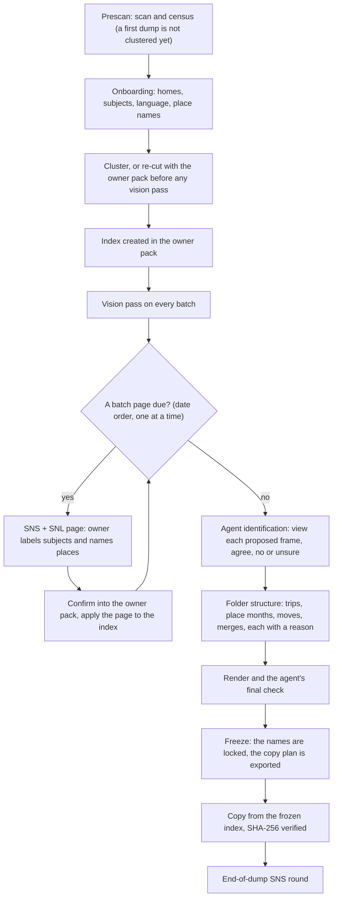

# Photo Manager

The engine sorts a dump of photographs and video into named folders. It holds no
facts about any owner: everything personal arrives at runtime from an owner pack.
This glossary is the shared language for the sorting and memory domain.

## Language

### Places

**FSL** (Frequently-Seen-Location):
A location the owner is photographed at on enough separate days to be worth naming,
rather than described by a map lookup. Frequency is the only test.
_Avoid_: FSP, frequent place, hot spot

**Home**:
An FSL the owner has confirmed they live at. It is the top tier of FSL, not a
separate kind of thing — the same discovery finds both, and frequency separates them.
_Avoid_: residence (in code), home location

**SNL** (Select and Name the Location):
The checkpoint where the engine shows the owner an FSL it has found and asks what
they call it, and whether they live there.
_Avoid_: place confirmation, home question

**Owner label**:
The name the owner gives a place at SNL. It is the owner's own word, not the map's.

**Geocoded name**:
The name a map service returns for a coordinate. Always a fallback for an owner label,
never a replacement for one.

### Subjects

**Subject**:
An individual animal the engine can recognise across photographs, held as a record
with visual exemplars.
_Avoid_: pet, entity, identity

**SNS** (Select and Name the Subject):
The checkpoint where the engine shows the owner frames of a subject it has drafted
and asks who it is.

**Draft**:
A subject the engine has grouped but the owner has not yet named. It renders its
class word, never a name.

**Exemplar**:
A frame the owner picked, stored as evidence of a subject's identity. Only owner-picked
frames become exemplars; an agent-confirmed name never makes one.

### Naming

**Batch**:
A day cluster of files that becomes one candidate folder. A batch is not a place — a
day trip and the evening back home fall in the same batch.

**Provenance**:
The record of where a name came from, carried beside the name itself. A name derived
from a frame the owner saw is trusted differently from one propagated by similarity.

**Owner-picked**:
A subject name the owner gave by picking frames on a batch page. The label's provenance
stays bare `viewed-image:`; who picked it is recorded in the index's `pages[].rows`.
_Avoid_: `viewed-image:owner-picked` (a planned spelling that was never built)

**Agent-confirmed**:
A subject name the agent applied after viewing a frame that recognition proposed and
agreeing with it. The label's provenance stays bare `viewed-image:`. The view is recorded
in three places: the index's top-level `identify[]`, the label's `identified` key, and
`files[].who[]` as `by: agent-confirmed` with its `view`. `identify[]` sits at the top
level because `render` rebuilds `files[].who` on every run. An agent-confirmed name
teaches the owner pack nothing: no exemplar, no record moved.
_Avoid_: `viewed-image:agent-confirmed` (a planned spelling that was never built)

### Planning

**Index** (its readable view is `Index_pscan.md`):
The per-dump plan that carries every file from the prescan to the copy. There is one index per
dump, kept in the owner pack under `photo-index/<dump>/`, beside the rest of the owner's photo
memory. `index.json` is the only truth; `Index_pscan.md` is a view rewritten after every change
and never edited by hand. The index holds no coordinates.
_Avoid_: plan file, plans.json (which `freeze` exports from the index), manifest

**Phase**:
A named state of the index: `pscan00` after the prescan, `onb` after the re-cut, `final` once
frozen. ⚠️ A per-batch phase (`Bnn` after batch nn) is NOT BUILT: applying a batch page logs the
change but leaves the phase as it was.

**Prescan**:
The first pass over a whole dump: scan, cluster and census. The index is built from it — one
folder per batch, named by date and place — before any batch page is put to the owner. A first
dump is scanned, onboarded and only then clustered, so its homes shape the batches.

**Re-cut**:
Regrouping a dump's batches right after onboarding, so the owner's homes and named places shape
the folders. It runs before any photograph is looked at.
_Avoid_: re-cluster (in owner-facing text)

**Training phase**:
The first few batches that have something to ask. Each one gets a single SNS + SNL page, and the
owner's picks become supervised labels.

**Supervised label**:
A frame the owner picked and named at SNS during the training phase. It is stored in the owner
pack as evidence of a subject, never inferred.

**Agent identification**:
After the training phase, recognition proposes a confirmed subject's name on frames that were
viewed, and the agent names the subject only after viewing the frame and agreeing. A `no` or an
`unsure` is recorded and names nothing; a blank names nothing and is recorded nowhere. Only
identity-space matches are proposed. It teaches the owner pack nothing.

**Leg**:
A sub-folder of a trip, or of an FSL month. A leg names its place only when that place differs
from its parent's.

**FSL month**:
A monthly parent folder for one named FSL, holding each visit that month as a leg.

**Place id**:
The fixed id a home or an FSL carries in the owner pack, so that renaming the place reaches every
folder that uses it.

**Freeze**:
Locking the index after the agent's final check. The frozen index, with its rendered names, is the
copy plan; a rename made afterwards does not change it.

### Process flow

Every change to the index is written to its log with a reason.
